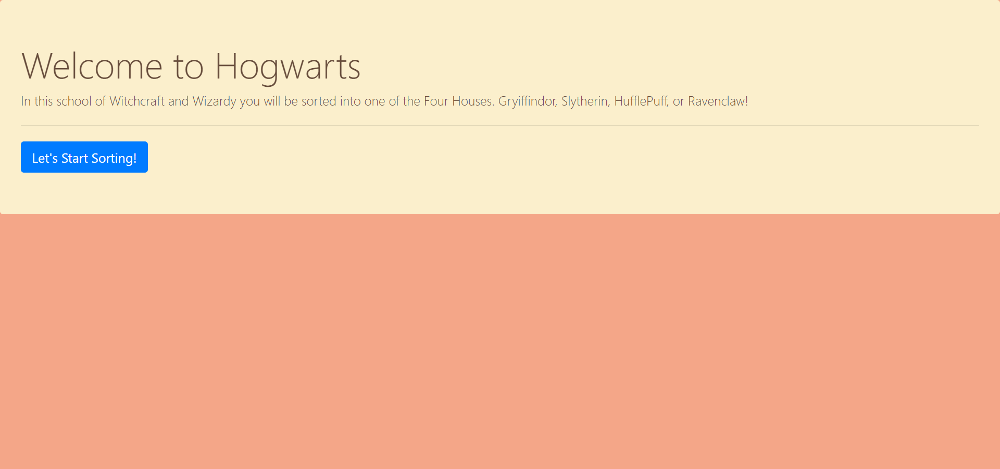

# sorting-hat

This project we worked on creating a sorting hat, Harry Potter Style! It demonstrates using javascript and bootstrap forms to take the name of a student, and randomly assign them to a Hogwarts house. This is all created and drawn to the DOM upon button click, and event listeners are used as well.

#Technology Used
HTML, CSS, Javascript, Bootstrap, HTML server
